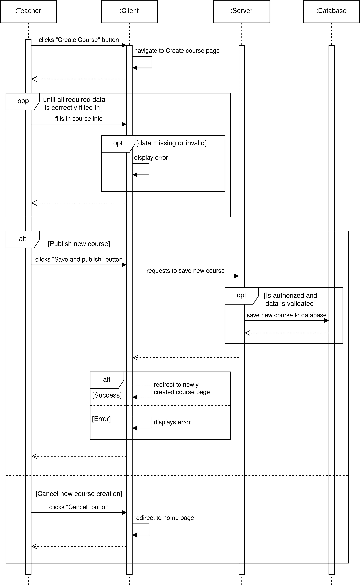
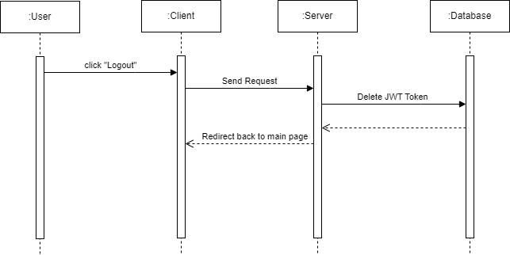
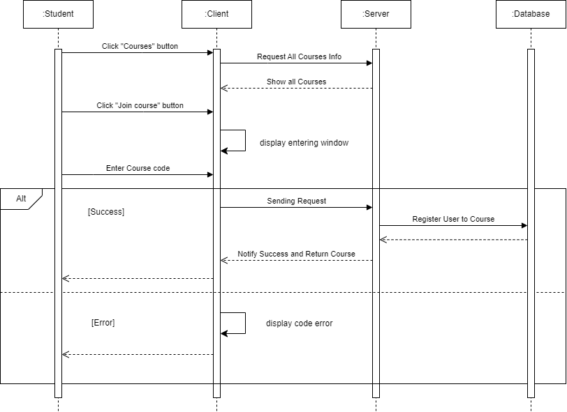
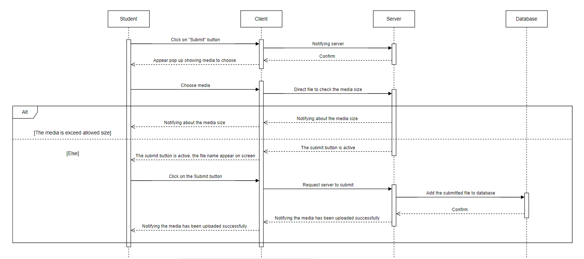

# vgupe2023_team2

## Project: [LAPP](https://docs.google.com/document/d/1-nmSOiMTKfd_a97TnvdPY18_VqLa1RAgG1yS37_zXLo/edit)

## Members:

1.  Phan Chí Thọ: https://gitlab.com/TomNewbie (17232)
2.  Trần Nguyễn Minh Quân: https://gitlab.com/17640 (17640)
3.  Lê Hoàng Kim Thanh https://gitlab.com/Kimthanh11 (18047) (Leader)
4.  Nguyễn Lê Anh Quân https://gitlab.com/WataNekko (18875)
5.  Phạm Nguyễn Đan Quỳnh https://gitlab.com/pndquyynh (17937)
6.  Lê Hoàng Đăng Nguyên https://gitlab.com/NguyenLe1605 (17028)
7.  Vương Khánh Linh https://gitlab.com/peLinh (18070)
8.  Hoàng Minh Thông https://gitlab.com/Shwooshie (17995)

## Use case

Use-Case Diagrams and Sequence diagrams

- 2 Primary Actors: Lecturer and Student

- 16 use cases
<p align="center">

</p>

### Actor: Lecturer

#### 1. Create Course:

| Use Case ID       | Create Course_1    |
| ----------------- | ------------------ |
| Use Case Name     | Create Course      |
| Created By        | Minh Quan          |
| Date Created      | 28/02/2023         |
| Last Updated By   | Quan Nguyen Le Anh |
| Date Last Updated | 05/03/2023         |

| Actors               | Lecturer                                                                                           |
| -------------------- | -------------------------------------------------------------------------------------------------- | ---------------------------------------------- |
| Description          | Lecturer creates course for students to join                                                       |
| Trigger              | Lecturer clicks the “Create Course” button                                                         |
| Preconditions        | The lecturer is logged in to the site with their account.                                          |
|                      | The lecturer has the necessary permissions to create a course.                                     |
|                      | The lecturer has all the necessary information and materials to create the course.                 |
| Postconditions       | The course is created and published on the site.                                                   |
|                      | The lecturer can edit or update the course information at any time.                                |
|                      | The lecturer can delete the course if necessary.                                                   |
| Priority             | high                                                                                               |
| Normal Flow          | 1. The lecturer navigates to the "Create Course" page.                                             |
|                      | 2. The lecturer fills in the required information for the course, including the course             | title, description, objectives, and materials. |
|                      | 3. The lecturer adds a course image or video to make the course more attractive to                 | potential students.                            |
|                      | 4. The lecturer saves the course information.                                                      |
|                      | 5. The course is now published and available for students to join.                                 |
| Alternative Flows    | Alternative Flow 1: The lecturer cancels the creation of the new course                            |
|                      | 1. The lecturer decides to cancel the creation of the new course                                   |
|                      | 2. The lecturer clicks the “Cancel” button                                                         |
|                      | 3. Confirmation box is shown                                                                       |
|                      | 4. The creation of the new course is canceled and the lecturer is redirected back to the home page |
| Exceptions           | The lecturer encounters an error when creating the new course.                                     |
|                      | 1. An error occurs while creating the course (such as missing information or invalid data)         |
|                      | 2. The system prompts the lecturer to correct the errors before publishing the new course.         |
| Special Requirements |                                                                                                    |
| Notes and Issues     |                                                                                                    |

<p align="center">

</p>

#### 2. Modify Course:

| Use Case ID       | Modify Course_2      |
| ----------------- | -------------------- |
| Use Case Name     | Modify Course        |
| Created By        | Minh Quan            |
| Date Created      | 28/02/2023           |
| Last Updated By   | Nguyen Le Hoang Dang |
| Date Last Updated | 05/03/2023           |

| Actors               | Lecturer                                                                                                                                            |
| -------------------- | --------------------------------------------------------------------------------------------------------------------------------------------------- |
| Description          | Lecturer modifies the Course to reflect changes in the course content, structure, or schedule                                                       |
| Trigger              | Lecturer clicks the “Modify Course” button                                                                                                          |
| Preconditions        | The lecturer must be logged in to the learning system.                                                                                              |
|                      | The lecturer must have permission to modify the course.                                                                                             |
| Postconditions       | The course has been modified to reflect the lecturer's changes, or remains unchanged if modifications were not saved.                               |
|                      | Students enrolled in the course can access the updated course information.                                                                          |
| Priority             | medium                                                                                                                                              |
| Normal Flow          | 1. The lecturer selects the course they wish to modify from the list of courses available to them.                                                  |
|                      | 2. The lecturer navigates to the course editing interface within the learning system.                                                               |
|                      | 3. The lecturer makes the necessary changes to the course content, structure, or schedule, using the editing tools provided by the learning system. |
|                      | 4. The lecturer saves the changes to the course.                                                                                                    |
|                      | 5. The learning system confirms that the changes have been saved and updates the course information accordingly.                                    |
| Alternative Flows    | Alternate Scenario 1: lecturer cancels course modifications.                                                                                        |
|                      | 1. The lecturer decides not to make the changes to the course after all.                                                                            |
|                      | 2. The lecturer navigates away from the course editing interface without saving any changes.                                                        |
|                      | 3. The learning system confirms that no changes were made to the course.                                                                            |
| Exceptions           | Lectuer encounters an error when trying to modify the course.                                                                                       |
|                      | 1. The lecturer receives an error message when attempting to save changes to the course.                                                            |
|                      | 2. The learning system provides the lecturer with information about the error and suggestions for resolving it.                                     |
|                      | 3. The lecturer makes the necessary changes to resolve the error and tries again to save the modifications to the course.                           |
| Special Requirements |                                                                                                                                                     |
| Notes and Issues     |                                                                                                                                                     |

<p align="center">

</p>

#### 3. Upload materials

| Use Case ID       | Upload materials_3   |
| ----------------- | -------------------- |
| Use Case Name     | Upload materials     |
| Created By        | Minh Quan            |
| Date Created      | 28/02/2023           |
| Last Updated By   | Nguyen Le Hoang Dang |
| Date Last Updated | 05/03/2023           |

| Actors               | Lecturer                                                                                                                       |
| -------------------- | ------------------------------------------------------------------------------------------------------------------------------ |
| Description          | Lecturer can upload materials to the Course                                                                                    |
| Trigger              | Lecturer clicks the “Upload Material” button                                                                                   |
| Preconditions        | The lecturer must be logged in to the learning system.                                                                         |
|                      | The lecturer must have permission to upload materials.                                                                         |
|                      | The course is already existed.                                                                                                 |
| Postconditions       | The material has been uploaded to the learning system and can be accessed by the lecturer and students enrolled in the course. |
| Priority             | high                                                                                                                           |
| Normal Flow          | 1. The lecturer selects the course they wish to upload materials for from the list of courses available to them.               |
|                      | 2. The lecturer navigates to the materials upload interface within the learning system.                                        |
|                      | 3. The lecturer selects the type of material they wish to upload (e.g., document, video, audio).                               |
|                      | 4. The lecturer selects the file they wish to upload from their computer or other device.                                      |
|                      | 5. The lecturer adds a title and description for the material.                                                                 |
|                      | 6. The lecturer clicks the "upload" button.                                                                                    |
|                      | 7. The learning system confirms that the file has been uploaded.                                                               |
| Alternative Flows    | Alternate Scenario 1: lecturer cancels material upload.                                                                        |
|                      | 1. The lecturer decides not to upload the material after all.                                                                  |
|                      | 2. The lecturer navigates away from the materials upload interface without uploading any files.                                |
|                      | 3. The learning system confirms that no files were uploaded.                                                                   |
| Exceptions           | Lecturer encounters an error when trying to upload materials.                                                                  |
|                      | 1. The lecturer receives an error message when attempting to upload the file.                                                  |
|                      | 2. The learning system provides the lecturer with information about the error and suggestions for resolving it.                |
|                      | 3. The lecturer makes the necessary changes to resolve the error and tries again to upload the file.                           |
| Special Requirements |                                                                                                                                |
| Notes and Issues     |                                                                                                                                |

For uploading materials and modifying materials requirement, the sequence diagrams are similar to modifying course requirements, so I don’t draw those.

#### 4. Modify Material:

| Use Case ID       | Modify Material_4    |
| ----------------- | -------------------- |
| Use Case Name     | Modify Material      |
| Created By        | Minh Quan            |
| Date Created      | 28/02/2023           |
| Last Updated By   | Nguyen Le Hoang Dang |
| Date Last Updated | 05/03/2023           |

| Actors               | Lecturer                                                                                                                    |
| -------------------- | --------------------------------------------------------------------------------------------------------------------------- |
| Description          | Lecturer can modify the materials that he/she has uploaded before                                                           |
| Trigger              | Lecturer clicks the “Modify” button                                                                                         |
| Preconditions        | There exists a material in the first place                                                                                  |
|                      | The lecturer must be logged in to the learning system.                                                                      |
|                      | The lecturer must have permission to modify materials.                                                                      |
| Postconditions       | The materials are modified and updated so that all students can see them                                                    |
|                      | The lecturer can update the link to the material in the course content or share it with students via another method.        |
| Priority             | high                                                                                                                        |
| Normal Flow          | 1. The lecturer selects the course they wish to modify materials for from the list of courses available to them.            |
|                      | 2. The lecturer navigates to the materials editing interface within the learning system.                                    |
|                      | 3. The lecturer selects the material they wish to modify.                                                                   |
|                      | 4. The lecturer makes the necessary changes to the material using the editing tools provided by the learning system.        |
|                      | 5. The lecturer saves the changes to the material.                                                                          |
|                      | 6. The learning system confirms that the changes have been saved and updates the material information accordingly.          |
| Alternative Flows    | Alternate Scenario 1: Lecturer cancels material modifications.                                                              |
|                      | 1. The lecturer decides not to make changes to the material after all.                                                      |
|                      | 2. The lecturer navigates away from the materials editing interface without saving any changes.                             |
|                      | 3. The learning system confirms that no changes were made to the material.                                                  |
| Exceptions           | Lecturer encounters an error when trying to modify materials.                                                               |
|                      | 1. The lecturer receives an error message when attempting to save changes to the material.                                  |
|                      | 2. The learning system provides the lecturer with information about the error and suggestions for resolving it.             |
|                      | 3. The lecturer makes the necessary changes to resolve the error and tries again to save the modifications to the material. |
| Special Requirements |                                                                                                                             |
| Notes and Issues     |                                                                                                                             |

For uploading materials and modifying materials requirement, the sequence diagrams are similar to modifying course requirements, so I don’t draw those.

#### 5. Track Students’ Activities:

| Use Case ID       | Track Students’ Activities_5 |
| ----------------- | ---------------------------- |
| Use Case Name     | Track Students’ Activities   |
| Created By        | Minh Quan                    |
| Date Created      | 28/02/2023                   |
| Last Updated By   | Quan Tran Nguyen Minh        |
| Date Last Updated | 06/03/2023                   |

| Actors               | Lecturer                                                                                                                                 |
| -------------------- | ---------------------------------------------------------------------------------------------------------------------------------------- |
| Description          | Lecturer can track student’s activities by seeing whether student submits exercise on time or late or not do homework                    |
| Trigger              | Lecturer clicks the “Track Activities” button                                                                                            |
| Preconditions        | There must be a table called “Submission” table in Database, which holds information about: Student’s id, Submitted file, Submitted Time |
| Postconditions       | Lecturer knows who submits exercise on time, and who submits exercise late and who did not do homework                                   |
| Priority             | high                                                                                                                                     |
| Normal Flow          | 1. Teacher clicks the “Track Activities” button                                                                                          |
|                      | 2. The system gets the ID of Students who have already submitted Exercise from Database                                                  |
|                      | 3. The system gets submitted time of that Student from Database                                                                          |
|                      | 4. The System gets the Due Time of the Exercise from Database                                                                            |
|                      | 5. The System compares the Submitted Time and Due Time                                                                                   |
|                      | 6. The System creates a table to list ID, Student’s name, Submission Status (On time, Late, Not Submit)                                  |
| Alternative Flows    |                                                                                                                                          |
| Exceptions           | At step 2, if no ID, then label that Student to be “Not Submit”                                                                          |
|                      | At step 5, if Submitted Time <= Due Time, then label that Student to be “On Time”                                                        |
|                      | At step 5, if Submitted Time > Due Time, then label that Student to be “Late”                                                            |
| Special Requirements |                                                                                                                                          |
| Notes and Issues     |                                                                                                                                          |

<p align="center">

</p>

#### 6. Upload exercise

| Use Case ID       | Upload exercise_6     |
| ----------------- | --------------------- |
| Use Case Name     | Upload exercise       |
| Created By        | Minh Quan             |
| Date Created      | 28/02/2023            |
| Last Updated By   | Quan Tran Nguyen Minh |
| Date Last Updated | 07/03/2023            |

| Actors               | Lecturer                                                                                                                                                       |
| -------------------- | -------------------------------------------------------------------------------------------------------------------------------------------------------------- |
| Description          | Lecturer uploads exercise to the Course                                                                                                                        |
| Trigger              | Lecturer clicks the “Upload Exercise” button                                                                                                                   |
| Preconditions        | There exists a Course                                                                                                                                          |
| Postconditions       | Exercises are uploaded to the Course and stored in Database (with the Exercise file and die time for submission) and students are informed of the new Exercise |
| Priority             | high                                                                                                                                                           |
| Normal Flow          | 1. Lecturer clicks the “Upload Exercise” button                                                                                                                |
|                      | 2. Lecturer chooses the Exercise file to upload                                                                                                                |
|                      | 3. Lecturer enters the due time for the Exercise submission                                                                                                    |
|                      | 4. The system stores the Exercise file and due time to Database                                                                                                |
|                      | 5. The system notifies Lecturers that the Exercise is uploaded successfully                                                                                    |
|                      | 6. The system notifies Students that there is a new Exercise with a due time                                                                                   |
| Alternative Flows    |                                                                                                                                                                |
| Exceptions           | At step 2, if there is no file, then show a pop-up to notify lecturer, then end                                                                                |
| Special Requirements |                                                                                                                                                                |
| Notes and Issues     |                                                                                                                                                                |

<p align="center">

</p>

#### 7. Delete Exercise:

| Use Case ID       | Delete Exercise_7  |
| ----------------- | ------------------ |
| Use Case Name     | Delete Exercise    |
| Created By        | Minh Quan          |
| Date Created      | 28/02/2023         |
| Last Updated By   | Quan Nguyen Le Anh |
| Date Last Updated | 05/03/2023         |

| Actors               | Lecturer                                                                                                  |
| -------------------- | --------------------------------------------------------------------------------------------------------- |
| Description          | Lecturer can delete the exercises if they are irrelevant                                                  |
| Trigger              | Lecturer clicks the “Delete Exercise” button                                                              |
| Preconditions        | The lecturer is logged in to the site with their account.                                                 |
|                      | The lecturer has the necessary permissions to delete exercises in a course.                               |
|                      | The course containing the exercise and the exercise to be deleted has already been created and published. |
| Postconditions       | The exercise is deleted from the Course                                                                   |
| Priority             | medium                                                                                                    |
| Normal Flow          | 1. The lecturer navigates to the course page containing the exercise they wish to delete.                 |
|                      | 2. The lecturer clicks on the "Delete Exercise" button for the specific exercise they want to delete.     |
|                      | 3. The system displays a confirmation dialog box, asking the lecturer to confirm the deletion.            |
|                      | 4. The lecturer confirms the deletion.                                                                    |
|                      | 5. The system deletes the exercise and notifies the lecturer of the successful deletion.                  |
| Alternative Flows    | Alternative Flow 1: Cancel deletion                                                                       |
|                      | 1. The lecturer decides to cancel the exercise deletion                                                   |
|                      | 2. The lecturer clicks the “Cancel” button                                                                |
|                      | 3. The exercise is not deleted                                                                            |
| Exceptions           | The lecturer encounters an error when deleting.                                                           |
|                      | An error occurs while deleting the exercise                                                               |
|                      | The system informs the lecturer of the error and provides guidance on how to proceed.                     |
| Special Requirements |                                                                                                           |
| Notes and Issues     |                                                                                                           |

<p align="center">

</p>

#### 8. Modify Exercise:

| Use Case ID       | Modify Exercise_8  |
| ----------------- | ------------------ |
| Use Case Name     | Modify Exercise    |
| Created By        | Minh Quan          |
| Date Created      | 28/02/2023         |
| Last Updated By   | Quan Nguyen Le Anh |
| Date Last Updated | 05/03/2023         |

| Actors               | Lecturer                                                                                                                     |
| -------------------- | ---------------------------------------------------------------------------------------------------------------------------- |
| Description          | Lecturer makes changes to the existing exercise                                                                              |
| Trigger              | Lecturer clicks the “Modify Exercise” button                                                                                 |
| Preconditions        | The lecturer is logged in to the site with their account.                                                                    |
|                      | The lecturer has the necessary permissions to modify exercises in a course.                                                  |
|                      | The course containing the exercise and the exercise to be modified has already been created and published.                   |
| Postconditions       | The exercise is modified and updated                                                                                         |
| Priority             | medium                                                                                                                       |
| Normal Flow          | 1. The lecturer navigates to the course page containing the exercise they wish to modify.                                    |
|                      | 2. The lecturer clicks on the "Edit Exercise" button for the specific exercise they want to modify.                          |
|                      | 3. The system displays the existing exercise information (such as the exercise prompt, instructions, sample solution, etc.). |
|                      | 4. The lecturer modifies the exercise information as desired.                                                                |
|                      | 5. The lecturer saves the modified exercise information.                                                                     |
|                      | 6. The system updates the exercise information and notifies the lecturer of the successful modification.                     |
| Alternative Flows    | Alternative Flow 1: Cancel modification                                                                                      |
|                      | 1. The lecturer decides to cancel the exercise modification                                                                  |
|                      | 2. The lecturer clicks the “Cancel” button                                                                                   |
|                      | 3. Confirmation box is shown                                                                                                 |
|                      | 4. The modification is not saved                                                                                             |
| Exceptions           | The lecturer encounters an error when modifying.                                                                             |
|                      | 1. An error occurs while modifying the exercise (such as missing information or invalid data)                                |
|                      | 2. The system prompts the lecturer to correct the errors before submitting the modification.                                 |
| Special Requirements |                                                                                                                              |
| Notes and Issues     |                                                                                                                              |

<p align="center">

</p>

#### 9. Evaluate Students’ Performance

| Use Case ID       | Evaluate Students’ Performance_9 |
| ----------------- | -------------------------------- |
| Use Case Name     | Evaluate Students’ Performance   |
| Created By        | Minh Quan                        |
| Date Created      | 28/02/2023                       |
| Last Updated By   | Tho Phan Chi                     |
| Date Last Updated | 05/03/2023                       |

| Actors               | Lecturer                                                                                  |
| -------------------- | ----------------------------------------------------------------------------------------- | -------------------------------------- |
| Description          | Lecturer can evaluate students’ performance to determine he/she passes the                | Course or not at the end of the Course |
| Trigger              | Teacher clicks the “Evaluate Performance” button in the specific course page              |
| Preconditions        |                                                                                           |
| Postconditions       | Lecturer can see the performance (how many exercises are accomplished, % of progress,...) |
| Priority             | high                                                                                      |
| Normal Flow          | 1. Teacher clicks the “Evaluate Performance” button to see the student’s performance      |
|                      | 2. A list of student who attending the class will appear                                  |
|                      | 3. The teacher click pass or not pass button next to each name                            |
| Alternative Flows    | The student didn’t pass the course                                                        |
|                      | 3.1 A red notification text with percentage to show the student didn’t pass the course    |
| Exceptions           | Student ID not found                                                                      |
|                      | 2.1 System notifies lecturers that the ID not found                                       |
|                      | 2.2 Back to step 1                                                                        |
| Special Requirements |                                                                                           |
| Notes and Issues     |                                                                                           |

<p align="center">

</p>

### Actor: Lecturer and Student

#### 10. Log in

| Use Case ID       | Log in_10    |
| ----------------- | ------------ |
| Use Case Name     | Log in       |
| Created By        | Minh Quan    |
| Date Created      | 28/02/2023   |
| Last Updated By   | Tho Phan Chi |
| Date Last Updated | 07/03/2023   |

| Actors               | Lecturer, Student                                                                                  |
| -------------------- | -------------------------------------------------------------------------------------------------- |
| Description          | Lecturer/Student logs in to the system using his/her account                                       |
| Trigger              | Lecturer/Student clicks the “Log in” button                                                        |
| Preconditions        | Lecturer/Student has already created an account                                                    |
| Postconditions       | Lecturer/Student logs in successfully and go to the Lecturer’s / Student’s view/interface          |
| Priority             | high                                                                                               |
| Normal Flow          | 1. Lecturer/Student clicks the “Log in” button                                                     |
|                      | 2. Another screen appear and direct user to Google login page (OAuth)                              |
|                      | 3. User will login the Google account                                                              |
|                      | 4. After login successfully, it will return back to the system and notify that successfully log in |
| Alternative Flows    |                                                                                                    |
| Exceptions           |                                                                                                    |
| Special Requirements |                                                                                                    |
| Notes and Issues     |                                                                                                    |

<p align="center">

</p>

#### 11. Log out

| Use Case ID       | Log out_11   |
| ----------------- | ------------ |
| Use Case Name     | Log out      |
| Created By        | Minh Quan    |
| Date Created      | 28/02/2023   |
| Last Updated By   | Tho Phan Chi |
| Date Last Updated | 05/03/2023   |

| Actors               | Lecturer, Student                                              |
| -------------------- | -------------------------------------------------------------- |
| Description          | Lecturer/Student logs out off the account after finishing work |
| Trigger              | Lecturer/Student clicks the “Log out” button                   |
| Preconditions        |                                                                |
| Postconditions       | Lecturer/Student successfully logs out                         |
| Priority             | high                                                           |
| Normal Flow          | 1. Lecturer/Student clicks the “Log out” button                |
|                      | 2. Lecturer/Student confirms logging out and log out           |
| Alternative Flows    |                                                                |
| Exceptions           |                                                                |
| Special Requirements |                                                                |
| Notes and Issues     |                                                                |

<p align="center">

</p>
 
#### 12. Send message
|Use Case ID| Send message_12 |
|----------|--------| 
|Use Case Name|  Send message |
|Created By| Minh Quan |
|Date Created| 06/03/2023 |
|Last Updated By|  Minh Quan|
|Date Last Updated|  07/03/2023|

| Actors               | User (Lecturer or Student)                                                                                                                                                  |
| -------------------- | --------------------------------------------------------------------------------------------------------------------------------------------------------------------------- |
| Description          | Users, including both Lecturer and Student, can discuss to each other via email, which can be searched on the system                                                        |
| Trigger              | User clicks the “Send message” button                                                                                                                                       |
| Preconditions        | User must log in to the system already                                                                                                                                      |
|                      | Emails of all users must be stored in Database                                                                                                                              |
|                      | There exists a student posing a question                                                                                                                                    |
| Postconditions       | Sender and Receiver will be notified about the message status (delivered)                                                                                                   |
| Priority             | high                                                                                                                                                                        |
| Normal Flow          | 1. User selects a Receiver by clicking on a name on the Member List                                                                                                         |
|                      | 2. The system displays the gmail tab with the email of the Receiver                                                                                                         |
|                      | 3. User writes message contents                                                                                                                                             |
|                      | 4. User clicks “Send Message” button                                                                                                                                        |
|                      | 5. The gmail delivers the message and notifies Sender when the message is delivered successfully                                                                            |
|                      | 6. The gmail notifies Receiver that there is a new message                                                                                                                  |
| Alternative Flows    | At step 3,                                                                                                                                                                  |
|                      | 3.1. Sender clicks “Attachment”                                                                                                                                             |
|                      | 3.2. Sender selects a media (audio, images)                                                                                                                                 |
|                      | Continue to step 4 as in the Normal Flow                                                                                                                                    |
| Exceptions           | At step 3.2, if there is no media, show a pop-up to notify Sender, then end                                                                                                 |
|                      | At step 3.2, if the file type (pdf, mp3, wav…) of the selected media is not supported by the gmail (example: .zip file type), then show a pop-up to notify Sender, then end |
|                      | At step 3.2, if the file size is larger than the allowable file size on gmail, then show a pop-up to notify Sender, then end                                                |
| Special Requirements |                                                                                                                                                                             |
| Notes and Issues     |                                                                                                                                                                             |

#### 13. Find contact information

| Use Case ID       | Find contact information_16 |
| ----------------- | --------------------------- |
| Use Case Name     | Leave Course                |
| Created By        | Thanh Le Hoang Kim          |
| Date Created      | 05/03/2023                  |
| Last Updated By   | Thanh Le Hoang Kim          |
| Date Last Updated | 05/03/2023                  |

| Actors               | Student / Lecturer                                                                                           |
| -------------------- | ------------------------------------------------------------------------------------------------------------ |
| Description          | Students and lecturers can find the email of people they want to reach.                                      |
| Trigger              | Student/lecturer click the button search on the All course interface                                         |
| Preconditions        | The student and lecturer have registered in the system                                                       |
| Postconditions       | The lecturer/student can know the email of the people they search                                            |
| Priority             | high                                                                                                         |
| Normal Flow          | 1. Actor enters the name of people they want to search                                                       |
|                      | 2. Student click on the Search icon or click “Enter”                                                         |
|                      | 3. All profiles of people having the input name appear, but in full name, full position, lecturer or student |
|                      | 4. The actor click on the desired profile                                                                    |
|                      | 5. The actor can copy the email to send email via Google Mail or other email providers                       |
| Alternative Flows    | 1.1 Actor enter name but with typo                                                                           |
|                      | 1.2 Return to step 3 but with name having the similar pattern as the input name                              |
| Exceptions           | 1.1 Actor enter name does not exist on the system                                                            |
|                      | 1.2 The system show a popup ‘Can not find this name’, the actor click OK                                     |
|                      | Return to step 1                                                                                             |
| Special Requirements | We can apply typeahead to suggest name for the actors                                                        |
| Notes and Issues     |                                                                                                              |

The sequence for send message and find contact

<p align="center">
<p align="center">

</p>
</p>

### Actor: Student

#### 14. Register Course

| Use Case ID       | Attend Course_13 |
| ----------------- | ---------------- |
| Use Case Name     | Attend Course    |
| Created By        | Minh Quan        |
| Date Created      | 28/02/2023       |
| Last Updated By   | Tho Phan Chi     |
| Date Last Updated | 06/03/2023       |

| Actors               | Student                                                                                        |
| -------------------- | ---------------------------------------------------------------------------------------------- |
| Description          | Student can register Course available                                                          |
| Trigger              | Student clicks the “Register to a Course” button                                               |
| Preconditions        |                                                                                                |
| Postconditions       | Student successfully joins the Course and access to all the materials, exercises in the Course |
| Priority             | high                                                                                           |
| Normal Flow          | 1. Student clicks the “Course” button                                                          |
|                      | 2. The system will show all the course                                                         |
|                      | 3. Student selects a Course                                                                    |
|                      | 4. Student confirms registration                                                               |
| Alternative Flows    | At step 2,                                                                                     |
|                      | 2.1. Student searches for a Course                                                             |
|                      | Continue step 3 in the Normal Flow                                                             |
| Exceptions           | At step 2.1: The course not found                                                              |
|                      | 2.1.1: System notify that course not found                                                     |
|                      | 2.1.2: Back to step 2                                                                          |
|                      | At step 3: The course no longer available                                                      |
|                      | 3.1: System will show error (course can not register) to student                               |
|                      | 3.2: Back to step 2                                                                            |
| Special Requirements |                                                                                                |
| Notes and Issues     |                                                                                                |

<p align="center">

</p>

#### 15. Track Course Progress

| Use Case ID       | Track Course_14    |
| ----------------- | ------------------ |
| Use Case Name     | Track Course       |
| Created By        | Minh Quan          |
| Date Created      | 28/02/2023         |
| Last Updated By   | Thanh Le Hoang Kim |
| Date Last Updated | 05/03/2023         |

| Actors               | Student                                                                                                                                                  |
| -------------------- | -------------------------------------------------------------------------------------------------------------------------------------------------------- | --- | --------------- |
| Description          | Student can track his/her own progress to see how much of the course he/                                                                                 | she | has accomlished |
| Trigger              | Student clicks the “Progress” button on each course page                                                                                                 |
| Preconditions        | Student has already registered for that course                                                                                                           |
| Postconditions       | The students know how much time they spent on the course, how many percent did they finish the exercise, and how many points they got on each exercise … |
| Priority             | high                                                                                                                                                     |
| Normal Flow          | 1. Student searches for the course he/she registered                                                                                                     |
|                      | 2. Student clicks on that Course to go to the Course                                                                                                     |
|                      | 3. Student clicks the “Progress” button                                                                                                                  |
|                      | 4. The Progress of ABC course interface appears                                                                                                          |
| Alternative Flows    | Step 4 If the student has passed the course, there will be a section “Congratulate!” and the total grade                                                 |
|                      | Step 4 If the student want to print the progress they can click on Print button.                                                                         |
| Exceptions           |                                                                                                                                                          |
| Special Requirements | Only student and the lecturer of the course know the course progress of the student                                                                      |
| Notes and Issues     |                                                                                                                                                          |

<p align="center">

</p>

#### 16. Submit Exercise

| Use Case ID       | Submit Exercise_15    |
| ----------------- | --------------------- |
| Use Case Name     | Submit Exercise       |
| Created By        | Minh Quan             |
| Date Created      | 28/02/2023            |
| Last Updated By   | Quynh Pham Nguyen Dan |
| Date Last Updated | 07/03/2023            |

| Actors               | Student                                                                                                                                       |
| -------------------- | --------------------------------------------------------------------------------------------------------------------------------------------- |
| Description          | Student can submit exercise on the Course                                                                                                     |
| Trigger              | Student clicks the “Submit Exercise” button which located on the right hand side of each exercise                                             |
| Preconditions        | The exercise has been uploaded by the lecturer                                                                                                |
| Postconditions       | Student has successfully submitted the exercise                                                                                               |
|                      | The lecturer can see the submitted file on the system                                                                                         |
| Priority             | high                                                                                                                                          |
| Normal Flow          | 1. Student clicks the “Submit Exercise” button                                                                                                |
|                      | 2. A pop up appear, which shows the media to choose                                                                                           |
|                      | 3. The student choose media to upload                                                                                                         |
|                      | 4. Student clicks on the “Submit” button to submit                                                                                            |
| Alternative Flows    |                                                                                                                                               |
| Exceptions           | At step 3, if the capacity of the selected media exceeds the allowable capacity of the system, then show a pop-up to notify student, then end |
|                      | At step 2 No media exist, A popup appear to notify student, then end                                                                          |
| Special Requirements | The file format can be image, audio, video, pdf                                                                                               |
| Notes and Issues     |                                                                                                                                               |

<p align="center">

</p>

## ER diagram

<p align="center">

</p>

## Getting started

To make it easy for you to get started with GitLab, here's a list of recommended next steps.

Already a pro? Just edit this README.md and make it your own. Want to make it easy? [Use the template at the bottom](#editing-this-readme)!

## Add your files

- [ ] [Create](https://docs.gitlab.com/ee/user/project/repository/web_editor.html#create-a-file) or [upload](https://docs.gitlab.com/ee/user/project/repository/web_editor.html#upload-a-file) files
- [ ] [Add files using the command line](https://docs.gitlab.com/ee/gitlab-basics/add-file.html#add-a-file-using-the-command-line) or push an existing Git repository with the following command:

```
cd existing_repo
git remote add origin https://gitlab.com/galvdat/vgu_tinyprojects/pe2023/vgupe2023_team2.git
git branch -M main
git push -uf origin main
```

## Integrate with your tools

- [ ] [Set up project integrations](https://gitlab.com/galvdat/vgu_tinyprojects/pe2023/vgupe2023_team2/-/settings/integrations)

## Collaborate with your team

- [ ] [Invite team members and collaborators](https://docs.gitlab.com/ee/user/project/members/)
- [ ] [Create a new merge request](https://docs.gitlab.com/ee/user/project/merge_requests/creating_merge_requests.html)
- [ ] [Automatically close issues from merge requests](https://docs.gitlab.com/ee/user/project/issues/managing_issues.html#closing-issues-automatically)
- [ ] [Enable merge request approvals](https://docs.gitlab.com/ee/user/project/merge_requests/approvals/)
- [ ] [Automatically merge when pipeline succeeds](https://docs.gitlab.com/ee/user/project/merge_requests/merge_when_pipeline_succeeds.html)

## Test and Deploy

Use the built-in continuous integration in GitLab.

- [ ] [Get started with GitLab CI/CD](https://docs.gitlab.com/ee/ci/quick_start/index.html)
- [ ] [Analyze your code for known vulnerabilities with Static Application Security Testing(SAST)](https://docs.gitlab.com/ee/user/application_security/sast/)
- [ ] [Deploy to Kubernetes, Amazon EC2, or Amazon ECS using Auto Deploy](https://docs.gitlab.com/ee/topics/autodevops/requirements.html)
- [ ] [Use pull-based deployments for improved Kubernetes management](https://docs.gitlab.com/ee/user/clusters/agent/)
- [ ] [Set up protected environments](https://docs.gitlab.com/ee/ci/environments/protected_environments.html)

---

# Editing this README

When you're ready to make this README your own, just edit this file and use the handy template below (or feel free to structure it however you want - this is just a starting point!). Thank you to [makeareadme.com](https://www.makeareadme.com/) for this template.

## Suggestions for a good README

Every project is different, so consider which of these sections apply to yours. The sections used in the template are suggestions for most open source projects. Also keep in mind that while a README can be too long and detailed, too long is better than too short. If you think your README is too long, consider utilizing another form of documentation rather than cutting out information.

## Name

Choose a self-explaining name for your project.

## Description

Let people know what your project can do specifically. Provide context and add a link to any reference visitors might be unfamiliar with. A list of Features or a Background subsection can also be added here. If there are alternatives to your project, this is a good place to list differentiating factors.

## Badges

On some READMEs, you may see small images that convey metadata, such as whether or not all the tests are passing for the project. You can use Shields to add some to your README. Many services also have instructions for adding a badge.

## Visuals

Depending on what you are making, it can be a good idea to include screenshots or even a video (you'll frequently see GIFs rather than actual videos). Tools like ttygif can help, but check out Asciinema for a more sophisticated method.

## Installation

Within a particular ecosystem, there may be a common way of installing things, such as using Yarn, NuGet, or Homebrew. However, consider the possibility that whoever is reading your README is a novice and would like more guidance. Listing specific steps helps remove ambiguity and gets people to using your project as quickly as possible. If it only runs in a specific context like a particular programming language version or operating system or has dependencies that have to be installed manually, also add a Requirements subsection.

## Usage

Use examples liberally, and show the expected output if you can. It's helpful to have inline the smallest example of usage that you can demonstrate, while providing links to more sophisticated examples if they are too long to reasonably include in the README.

## Support

Tell people where they can go to for help. It can be any combination of an issue tracker, a chat room, an email address, etc.

## Roadmap

If you have ideas for releases in the future, it is a good idea to list them in the README.

## Contributing

State if you are open to contributions and what your requirements are for accepting them.

For people who want to make changes to your project, it's helpful to have some documentation on how to get started. Perhaps there is a script that they should run or some environment variables that they need to set. Make these steps explicit. These instructions could also be useful to your future self.

You can also document commands to lint the code or run tests. These steps help to ensure high code quality and reduce the likelihood that the changes inadvertently break something. Having instructions for running tests is especially helpful if it requires external setup, such as starting a Selenium server for testing in a browser.

## Authors and acknowledgment

Show your appreciation to those who have contributed to the project.

## License

For open source projects, say how it is licensed.

## Project status

If you have run out of energy or time for your project, put a note at the top of the README saying that development has slowed down or stopped completely. Someone may choose to fork your project or volunteer to step in as a maintainer or owner, allowing your project to keep going. You can also make an explicit request for maintainers.
